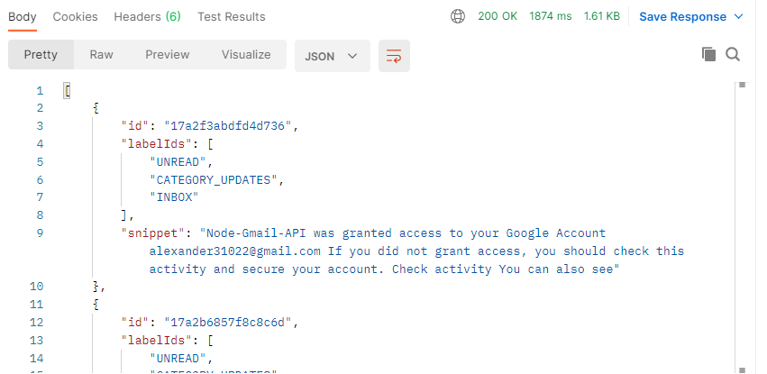

# Node-Gmail-API
Using Gmail API with Node.js for accessing emails

## Installing packages
> npm install

## Storing credentials
After creating a project enable Gmail API for the account and create client credentials for using the API. Store the credentials in *client_secret.json* file

## Running application
> node server.js

## Authorising the app
The application needs to be authorised first by the user to access the emails. The user will need to signin to their account and allow access to gmail. Acess tokens are received once the application is authorised.

### Request

### Authorising aftr authenticating

### Response

## Getting unread emails
Add the tokens received after authorising for requesting access to emails

### Request with headers

### Response

